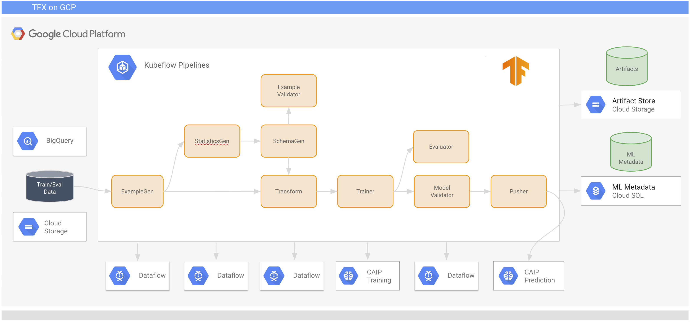

# Orchestrating model training and deployment with TFX on KFP

In this lab you will develop, deploy and run a TFX pipeline that uses Kubeflow Pipelines as an orchestrator.


## Lab scenario

You will be working with the [Covertype Data Set](https://github.com/jarokaz/mlops-labs/blob/master/datasets/covertype/README.md) dataset. 

The pipeline implements a typical TFX workflow as depicted on the below diagram:

.

The source data in a CSV file format is in the GCS bucket.

The TFX components run in containers orchestrated by Kubeflow Pipelines.


## Lab setup

Before proceeding with the lab, you must set up an **AI Platform Notebooks** instance and a **KFP** environment as detailed in `lab-01-environment-setup`.

## Lab Exercises

Follow the instructor who will walk you through the lab. The high level summary of the lab flow is as follows:

### Understanding the pipeline's DSL.

The pipeline uses the [tensorflow/tfx:0.15.0 image](https://hub.docker.com/r/tensorflow/tfx), as a runtime execution environment for the pipeline's components. 

The `Transform` and `Train` components are configured to retrieve the module file with the preprocessing and training code from the folder in the artifact store GCS bucket.

All code executes in containers on the GKE cluster.

## In AI Platform Notebooks Terminal

Clone the exercise files under your home directory.

```
cd
git clone https://github.com/jarokaz/mlops-miniworkshop.git
cd mlops-miniworkshop/lab-01-environment-setup
```

### Building and deploying the pipeline


In the **AI Platform Notebooks terminal**, start by configuring your environment settings:
```
export PROJECT_ID=$(gcloud config get-value core/project)
export PREFIX=$PROJECT_ID
export NAMESPACE=kubeflow
export REGION=us-central1
export ZONE=us-central1-a
export ARTIFACT_STORE_URI=gs://$PREFIX-artifact-store
export GKE_CLUSTER_NAME=$PREFIX-cluster
gcloud container clusters get-credentials $GKE_CLUSTER_NAME --zone $ZONE
export KFP_INVERSE_PROXY_HOST=$(kubectl describe configmap inverse-proxy-config -n kubeflow | grep "googleusercontent.com")
```

Where 
- [ARTIFACT_STORE_URI] is the URI of the bucket created during the KFP environment setup - `gs://[PREFIX]-artifact-store`
- [KFP_INVERSE_PROXY_HOST] is the hostname of the inverse proxy to your KFP installation. 
- [GKE_CLUSTER_NAME] is the name of your GKE cluster in the `[PREFIX]-cluster` format.

Upload the module file into the GCS location:
```
cd ~/mlops-miniworkshop/lab-03-tfx-pipeline
export MODULE_FILE_URI=${ARTIFACT_STORE_URI}/modules/transform_train.py
gsutil cp transform_train.py $MODULE_FILE_URI
```

Compile the pipeline.

```
export PIPELINE_NAME=tfx-covertype-$(date +%s)
export TRAINED_MODEL_URI=${ARTIFACT_STORE_URI}/trained_models/$PIPELINE_NAME
export DATA_ROOT_URI=gs://workshop-datasets/covertype/full
export TFX_IMAGE_URI=tensorflow/tfx:0.15.0

tfx pipeline create --engine kubeflow --pipeline_path pipeline_dsl.py --endpoint $KFP_INVERSE_PROXY_HOST
```

**Output from pipeline create command:**............. 'url': None}
Pipeline "tfx-covertype-1584420696" created successfully.

The `tfx pipeline create` command compiled the pipeline's DSL into the KFP package file - `tfx-covertype-1584420696.tar.gz`. The package file contains the description of the pipeline in the YAML format. If you want to examine the file, extract from the tarball file and use the JupyterLab editor.

```
tar xvf tfx-covertype-1584420696.tar.gz
```

The name of the extracted file is `pipeline.yaml`.

### Submitting and monitoring pipeline runs

After the pipeline has been deployed, you can trigger and monitor pipeline runs using **TFX CLI** or **KFP UI**.

To submit the pipeline run using **TFX CLI** and copy the **pipeline-name from the output e.g "tfx-covertype-1584420696" **:
```
tfx run create --pipeline_name $PIPELINE_NAME --endpoint $KFP_INVERSE_PROXY_HOST
```

To list all the active runs of the pipeline:
```
tfx run list --pipeline_name $PIPELINE_NAME --endpoint $KFP_INVERSE_PROXY_HOST
```

To retrieve the status of a given run (**Please update the pipeline_name with the newly create pipeline**):
```
tfx run status --pipeline_name tfx-covertype-1584420696 --run_id [YOUR_RUN_ID] --endpoint $KFP_INVERSE_PROXY_HOST
```

Where
- YOUR_RUN_ID is listed from the **tfx run list ...** command above

 To terminate a run:
 ```
 tfx run terminate --run_id [YOUR_RUN_ID] --endpoint $KFP_INVERSE_PROXY_HOST
 ```

## Accessing KFP UI

After the installation completes, you can access the KFP UI from the following URL. You may need to wait a few minutes before the URL is operational.

```
gcloud container clusters get-credentials $PROJECT_ID-cluster --zone $ZONE
echo "https://"$(kubectl describe configmap inverse-proxy-config -n kubeflow | \
grep "googleusercontent.com")
```

## Accessing KFP UI

After accessing the KFP UI from the following URL. Please spend some time in the following tabs:

** 1. Pipelines --> Click the tfx pipeline --> Graph **
** 1. Experiments --> Click the tfx pipeline --> Graph **
** 1. Artifacts --> Click the tfx pipeline **


